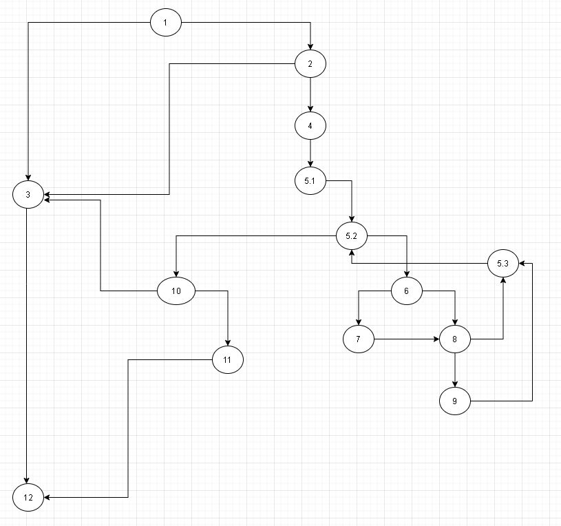
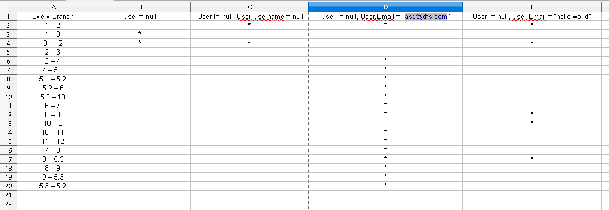

# Втора лабораториска вежба по софтверско инженерство

## Оливер Николовски, бр. на индекс 141217

### Група на код:
Ја добив групата на код 1

### Control Flow Graph

### Цикломатска комплексност
Цикломатската комплексност на овој код е 7, истата ја добив преку формулата P+1, каде што P е бројот на предикатни јазли. 
Во случајoв P=6, па цикломатската комплексност изнесува 7.

### Тест случаи според критериумот Every Path
1, 3, 12 -> user = null, allUsers = anything
ne vleguvame vo nitu eden if uslov
user = null, allUsers = List.of("user1", "user2", "user3")

1, 2, 3, 12 -> vleguvame samo vo prviot if, no ne i vo vgnezdeniot
user = new User(null, "password", "asdasdf@gmail.com"), allUsers = List.of("user1", "user2", "user3")

1, 2, 4, 5.1, 5.2, 10, 3, 12 -> vleguvame i vo vgnezdeniot if, no ne i vo for ciklusot
user = new User("user4", "password123", ""), allUsers = List.of("user1", "user2", "user3")

1, 2, 4, 5.1, 5.2, (6, 8, 5.3, 5.2), 10, 3, 12 -> vleguvame vo for ciklusot, no ne vo if uslovite vo nego
user = new User("username", "password", "email"), allUsers = List.of("user1", "user2", "user3")

1, 2, 4, 5.1, 5.2, (6, 7, 8, 5.3, 5.2), 10, 3, 12 -> vleguvame vo prviot if uslov vo for ciklusot
user = new User("username", "password", "email@"), allUsers = List.of("user1", "user2", "user3")

1, 2, 4, 5.1, 5.2, (6, 7, 8, 9, 5.3, 5.2), 10, 11, 12 -> vleguvame vo site if uslovi
user = new User("user4", "password123", "myemail4@gmail.com"), allUsers = List.of("user1", "user2", "user3")

### Тест случаи според критериумот Every branch
user = null, allUsers = List.of("user1", "user2", "user3");

user = new User(null, "password", "asdasdf@gmail.com"), allUsers = List.of("user1", "user2", "user3")

user = new User("user4", "password123", "myemail4@gmail.com"), allUsers = List.of("user1", "user2", "user3")

user = new User("username", "password", "email"), allUsers = allUsers = List.of("user1", "user2", "user3")

### Објаснување на напишаните unit tests
Матрицата со која ги изведов тестовите за every branch:
